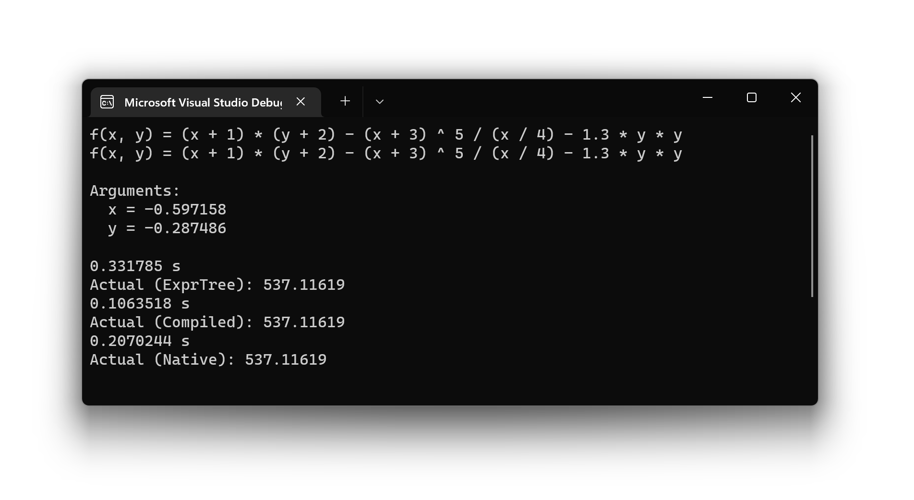

# JIT demo

A simple example showing how JIT works.

# Project structure

Miscellaneous directories:

* `cmake`: Contains CMake scripts.

Explore the codes in the following order:

* `expr`: Contains expression tree type definitions and parsing logic.
* `jit`: Contains JIT logic. (incomplete)
* `shell`: Contains a simple shell implementation using the features in the above 2 modules. `main()` is in `shell/main.cxx`. (incomplete)
